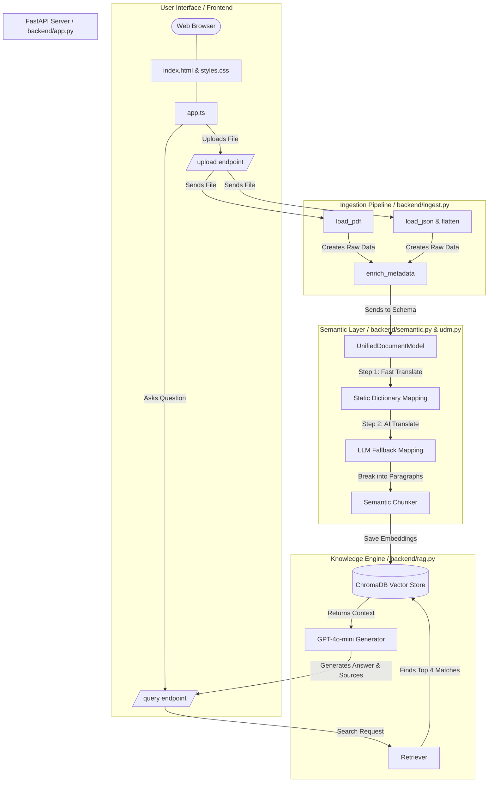

# Master's Thesis Prototype: Full Architectural Documentation

This document explains the entire Retrieval-Augmented Generation (RAG) prototype built for this Master's Thesis. It is written to be easily understood by everyone, regardless of coding experience, while maintaining precise technical accuracy.

## 1. What does this prototype do?
Imagine a company has 100 different financial reports spanning different years. Half of them are unstructured PDF files, and half are messy, deep JSON files. They all refer to "Total Revenue" using completely different words in German. 

If you ask an AI, *"What was the revenue of Company X in 2023?"*, it will likely fail or hallucinate because the data is too messy to read.

**This prototype solves this by:**
1. **Reading** the messy files.
2. **Translating** all the different German financial slang into one standard English format.
3. **Chunking** the text by its semantic meaning (breaking it into logical paragraphs).
4. **Storing** it in a searchable database.
5. **Answering** user questions using an AI that strictly cites its sources.

---

## 2. Architectural Diagram

Here is a visual map of how data flows through the system:

---

## 3. Explaining Every Script (The Backend)

The backend is built using **Python** and uses a framework called **FastAPI** to communicate with the frontend. It is split into 5 carefully organized files:

### A. `udm.py` (The Concept Blueprint)
UDM stands for **Unified Document Model**. Think of this as a strict empty checklist. Before this prototype will save *any* document, it forces the document to fit into this checklist. It ensures every file has a `company_name`, `fiscal_year`, and specific fields like `revenue` or `total_assets`. Without this file, the database would be structural chaos.

### B. `ingest.py` (The Reader)
This script is responsible for opening the actual files that you drag and drop into the system.
- If it sees a **PDF**, it uses a tool to scrape the raw text off every page.
- If it sees a **JSON** file (which is like a messy digital tree of data), it uses a special custom function called `flatten_financial_data()` to squeeze the entire tree flat so it's easy to read.
- **`ingest_single_file()`**: When you upload a single file in the UI, this function targets *only* that file, processes it, and saves it. This prevents the system from accidentally re-reading hundreds of old files.

### C. `semantic.py` (The Translator & Slicer)
This is the "brain" of the ingestion phase. It has two massive jobs:
1. **Mapping (Translating):** It looks at a German word from the file (like `Gesamtkapital`). First, it checks a fast "Static Dictionary" (`mapping_dictionary.json`). If it finds a match, it translates it instantly to `total_assets`. If the word is missing from the dictionary, it asks an AI LLM (OpenAI) to figure out what the word means and map it automatically. In this script, the valid fields list is dynamically imported directly from `udm.py`'s type hints so nothing is ever hardcoded!
2. **Chunking (Slicing):** You can't feed a 100-page document to an AI all at once. The `SemanticChunker` slices the document into paragraphs. However, instead of slicing strictly by word count, it uses AI to slice pieces exactly when the *topic* of the sentence changes.

### D. `rag.py` (The Search Engine & Answer Generator)
This script handles the final step: talking to the user. 
- **ChromaDB**: It creates a database folder (`chroma_db`) that mathematical saves the semantic chunks generated above.
- **The RAG Chain**: When a user asks *"What is the revenue?"*, this script fires a search into ChromaDB, retrieves the **Top 4** most relevant paragraphs, and hands them to a GPT-4 AI. 
- **Strict Prompting**: It strictly instructs GPT-4: *"You are a precision assistant. Answer the user's question USING ONLY the provided context. Do not hallucinate."* It then sends the final answer, alongside the exact file names it retrieved, back to the user.

### E. `app.py` (The Traffic Cop)
This script runs the actual web server. It doesn't do any heavy lifting itself. It simply opens up two "doors" for the frontend to use:
- **The `/upload` door**: Receives a file from the user and hands it to `ingest.py`.
- **The `/query` door**: Receives a chat question from the user and hands it to `rag.py`.

---

## 4. Explaining the Frontend (The User Interface)

The website you see in your web browser is explicitly built to be lightweight and modern without relying on heavy corporate frameworks like React.

### `index.html`
This is the skeleton of the website. It creates the physical layout: the header, the chat history box, the chat input box, and the new **Side Panel Dashboard** on the right side where users can drag and drop new reports.

### `styles.css`
This gives the website its premium look. It uses a modern design trend called **Glassmorphism**, which uses dark, cool slate colors (`#0F172A`), sleek dropped shadows, glowing rounded borders, and subtle hovering animations to make the UI look like a professional native app.

### `app.ts` (TypeScript)
This is the frontend brain. When you click "Upload" or "Ask", this script does the actual clicking.
- It intercepts your actions, changes the button text to *"Uploading..."* or *"..."* loading states.
- It packages your file or question into an HTTP Request and throws it to the backend `app.py` traffic cop.
- When the backend responds, it dynamically creates a new HTML chat bubble on your screen showing the AI's answer, its exact document sources, and an inline green Confidence Score percentage perfectly aligned in the chat history.
